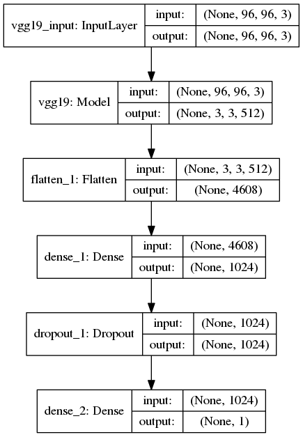

# Kaggle Histopathologic Cancer Detection Competition
In this competition, you must create an algorithm to identify metastatic cancer in small image patches taken from larger digital pathology scans. The data for this competition is a slightly modified version of the PatchCamelyon (PCam) benchmark dataset (the original PCam dataset contains duplicate images due to its probabilistic sampling, however, the version presented on Kaggle does not contain duplicates). 

# What is used for this competition
1) Keras
2) Tensorflow
3) Data Augmentation
4) Transfer Learning(VGG19 Pre Trained Network)
5) Keras Callbacks
6) ROC Curve

# Kaggle Kernel
If you would like to visit the kaggle kernel in which I created my submission for the competition it can be found here:
https://www.kaggle.com/twhitehurst3/cancer-detect-keras

Happy Learning!

